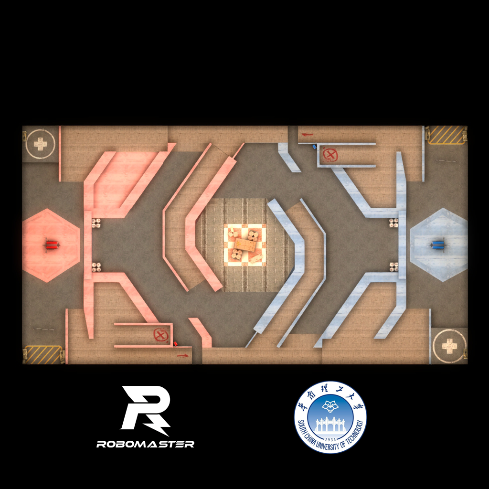

# RoboMaster 2020 x Counter-Strike: Global Offensive

## 版本特性
- 双方出生点间设置了防弹空气墙
- 每局开始前所有武器会被剥除
- 兵种被选择后对应的平板将消失
- 无人机使用霰弹枪（避免粘人），工程手枪，步兵及英雄冲锋枪
- 步兵血量600，工程800，英雄1000
- 调整太阳高度角以避免出现阴影区域，并修正了HDR最大自动曝光量
- 停机坪外设防弹空气墙，比赛正式开始30s后升至空中才可输出
- 限制了无人机的活动区域
- 双方空域中间设防弹空气墙，无人机对射无效
- 雷达系统已启用，请关注小地图上队友及敌人动向
- 资源岛下初始生成两只防爆盾，可抵挡300点伤害
- 占领资源岛红白相间区域每30s会获得三个燃烧瓶奖励（有全局hud通知），生成在资源岛最高点（只有工程可取得，交至英雄使用）
- 限制除工程和无人机外兵种的重力，即无法跳跃（上台阶）
- 进入对方的补给站禁区将受到500hp/s的伤害
- 地面补给站的补弹时间为5s，无人机补给站为30s，暂均不限次数
- 地面补给站可无限补血至本兵种血量上限，形式为医疗针，单管+50hp，扎针需要消耗一定时间
- 前哨站血量为2000，基地血量为5000，血量降为0时均有爆炸和燃烧效果以及全局hud通知
- 哨兵的攻击范围做了一定限制，本方前哨站被摧毁前无敌，摧毁后其血量为500

## 已知问题
- 有较低的概率在人数不足的情况下会出生在哨兵轨道（重开解决）
- 请勿攻击无人机（单向防弹无法实现）

## 使用说明
仓库目录下*.bsp.bz2为已打包好的地图文件，放进本机或服务器的`/csgo/maps`文件夹即可。

## 二次开发
source目录下*.vmf为Valve Hammer地图编辑器的工程源码，进行编辑后可以重新编译生成地图文件，然后使用VIDE等打包工具与该目录下其他文件进行打包。